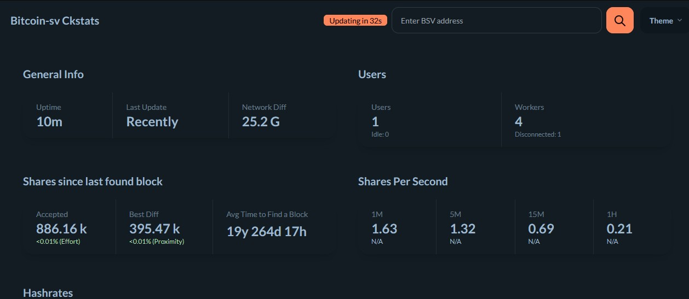

<p align="center">
  
</p>


# Bitcoin-sv with CKpool: Solo Mining  
A fully integrated, deterministic solo‑mining pool for Bitcoin-SV (BSV), combining:

- CKPool‑BSV — optimized CKPool fork for Bitcoin-SV  
- Bitcoin-sv Core — full node providing consensus, mempool, and block validation  
- CKStats — modern Next.js dashboard for real‑time pool monitoring  
- Systemd services — production‑grade orchestration  
- Artifact‑free configs — clean, reproducible, deterministic setup  

This repository provides everything required to run a self‑hosted, autonomous DigiByte solo‑mining pool.

---

## 🚀 Features

### CKPool‑BSV
- Lightweight, high‑performance solo mining pool  
- Supports ASICs  
- Custom BSV‑specific patches  
- Clean configuration (ckpool-BSV.conf)  
- Built‑in stratum server  
- Coinbase tag support via `btcsig`  

### Bitcoin-SV Core
- Full Bitcoin-sv node  
- Provides block templates to CKPool  
- Validates mined blocks  
- Exposes RPC for pool operations  
- Clean, unbuilt source included for reproducibility  

### CKStats Dashboard
- Next.js + Tailwind + TypeORM  
- Real‑time miner stats  
- Worker performance  
- Pool health  
- Block submissions  
- PostgreSQL backend  
- Clean `.env.example` included  

### Systemd Integration
- ckpool.service  
- bitcoinsv.service  
- ckstats.service  
- Automatic restart  
- Log rotation ready  

---

## 🔧 Build Instructions

### Bitcoin-SV Core
```
cd bitcoin-sv  
./autogen.sh  
./configure --without-wallet  
make -j$(nproc)  
sudo make install
```

### CKPool‑BSV
```
sudo apt-get install build-essential yasm libzmq3-dev
./configure
make
```

---

### CKStats Dashboard

Install Dependencies:

Install pnpm if not already available:

```
curl -fsSL https://get.pnpm.io/install.sh | bash
```

```
cp .env.example .env  
pnpm install  
pnpm build  
pnpm start
```

---

## ⚙️ Systemd Setup (Manual Creation)

### Create Bitcoin-sv service
```
sudo nano /etc/systemd/system/bitcoinsv.service
```

```
[Unit]
Description=Bitcoin-SV Daemon
After=network.target

[Service]
ExecStart=/home/umbrel/bitcoin-sv/src/bitcoind -conf=/home/umbrel/bitcoin-sv/ckpool-bsv/configs/bitcoinsv.conf
User=umbrel
Restart=always
TimeoutStopSec=90
Type=simple

[Install]
WantedBy=multi-user.target

```

### Create CKPool‑BSV service
```
sudo nano /etc/systemd/system/ckpoolbsv.service
```

```
[Unit]
Description=CKPool-BSV Solo Pool
After=network.target bitcoinsv.service

[Service]
ExecStart=/home/umbrel/bitcoin-sv/ckpool-bsv/src/ckpool -c /home/umbrel/bitcoin-sv/ckpool-bsv/ckpool.conf
User=umbrel
Restart=always
Type=simple

[Install]
WantedBy=multi-user.target

```

### Create CKStats Dashboard service
```
sudo nano /etc/systemd/system/ckstatsbsv.service
```

```
[Unit]
Description=CKStats Dashboard
After=network.target postgresql.service

[Service]
WorkingDirectory=/home/umbrel/bitcoin-sv/ckstats
ExecStart=/usr/bin/pnpm start
User=umbrel
Restart=always
Environment=NODE_ENV=production
Type=simple

[Install]
WantedBy=multi-user.target

```

### Enable and start all services
```
sudo systemctl daemon-reload
sudo systemctl enable bitcoinsv ckpool-bsv ckstats
sudo systemctl start bitcoinsv ckpool-bsv ckstats

```

---

# 🔥 PM2 Setup (Alternative to Systemd)

PM2 is a lightweight process manager that can supervise Bitcoin-sv Core, CKPool‑BSV, and CKStats.

---

## 1. Install PM2

```
sudo npm install -g pm2
pm2 -v
```

---

## 2. Start Bitcoin-sv Core under PM2

```
pm2 start /home/umbrel/bitcoin-sv/src/bitcoind --name bitcoin-sv -- \
  -conf=/home/umbrel/bitcoin-sv/data/bitcoinsv.conf \
  -daemon=0
  
```

Logs:

```
pm2 logs bitcoin-sv
```

---

## 3. Start CKPool‑BSV under PM2

```
pm2 start /home/umbrel/bitcoin-sv/ckpool-bsv/ --name ckpool-bsv -- \
  -c /home/umbrel/bitcoin-sv/ckpool-bsv/ckpool.conf

```

Logs:

```
pm2 logs ckpool-bsv
```

---

## 4. Start CKStats under PM2

```
cd /home/umbrel/bitcoin-sv/ckstats
pm2 start pnpm --name ckstats-bsv -- start
```

Logs:

```
pm2 logs ckstats
```

---

## 5. Save PM2 Process List

```
pm2 save
```

---

## 6. Enable PM2 Startup on Boot

```
pm2 startup
```

Follow the printed command.

---

## 7. PM2 Management Commands

Status:

```
pm2 status
```

Restart:

```
pm2 restart bitcoin-sv
pm2 restart ckpool-bsv
pm2 restart ckstats-bsv
```

Stop:

```
pm2 stop bitcoin-sv
pm2 stop ckpool-bsv
pm2 stop ckstats-bsv
```

Delete:

```
pm2 delete bitcoin-sv
pm2 delete ckpool-bsv
pm2 delete ckstats-bsv
```

---

## 🧪 Testing the Pool

### Check CKPool:
```
telnet localhost 3335
```

### Check Bitcoin-sv RPC:
```
bitcoin-cli -conf=/home/umbrel/bitcoin-sv/bitcoin.conf getblockchaininfo
```
### To speed up node sync:
```
~/Bitcoin-SV/src/bitcoin-cli -conf=/home/YOUR-PATH/Bitcoin-SV/data/bitcoin.conf addnode "node.bsv.network" add
~/Bitcoin-SV/src/bitcoin-cli -conf=/home/YOUR-PATH/Bitcoin-SV/data/bitcoin.conf addnode "sv.usebsv.com" add
~/Bitcoin-SV/src/bitcoin-cli -conf=/home/YOUR-PATH/Bitcoin-SV/data/bitcoin.conf addnode "sv.jochen-hoenicke.de" add
~/Bitcoin-SV/src/bitcoin-cli -conf=/home/YOUR-PATH/Bitcoin-SV/data/bitcoin.conf addnode "bsv.im" add
~/Bitcoin-SV/src/bitcoin-cli -conf=/home/YOUR-PATH/Bitcoin-SV/data/bitcoin.conf addnode "node.svpool.com" add
~/Bitcoin-SV/src/bitcoin-cli -conf=/home/YOUR-PATH/Bitcoin-SV/data/bitcoin.conf addnode "bsv.koreacentral.cloudapp.azure.com" add

```

### Check CKStats:
Open browser:

```
http://<your-ip>:3004
```

---

## 🛡️ Security Notes
- Never expose CKPool or Bitcoin-sv RPC to the public internet  
- Use firewall rules to restrict access  
- Keep `.env` files private  
- Only `.env.example` is committed  

---

## 📜 License
- CKPool‑BSV: GPLv2  
- Bitcoin-sv Core: MIT  
- CKStats: MIT  

---

## 🤝 Contributing
Pull requests are welcome.  
For major changes, open an issue first to discuss what you’d like to modify.

---

## ⭐ Acknowledgements
- Con Kolivas (CKPool)  
- Z3r0XG (lhr)
- Bitcoin-sv Core developers  
- Community contributors  
